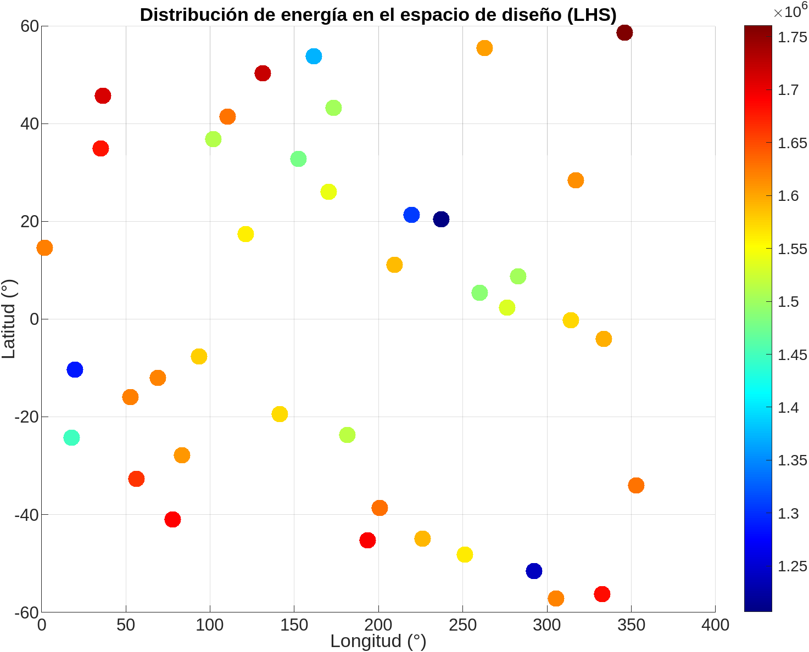
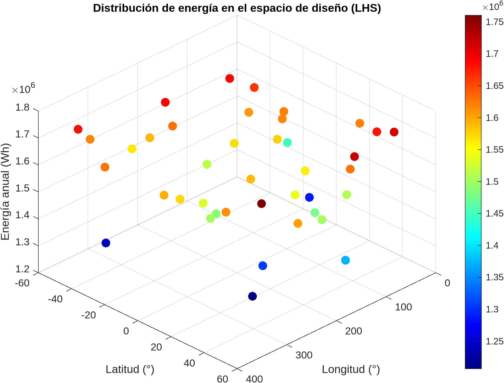
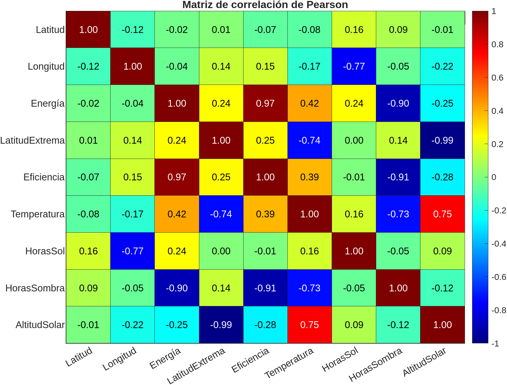
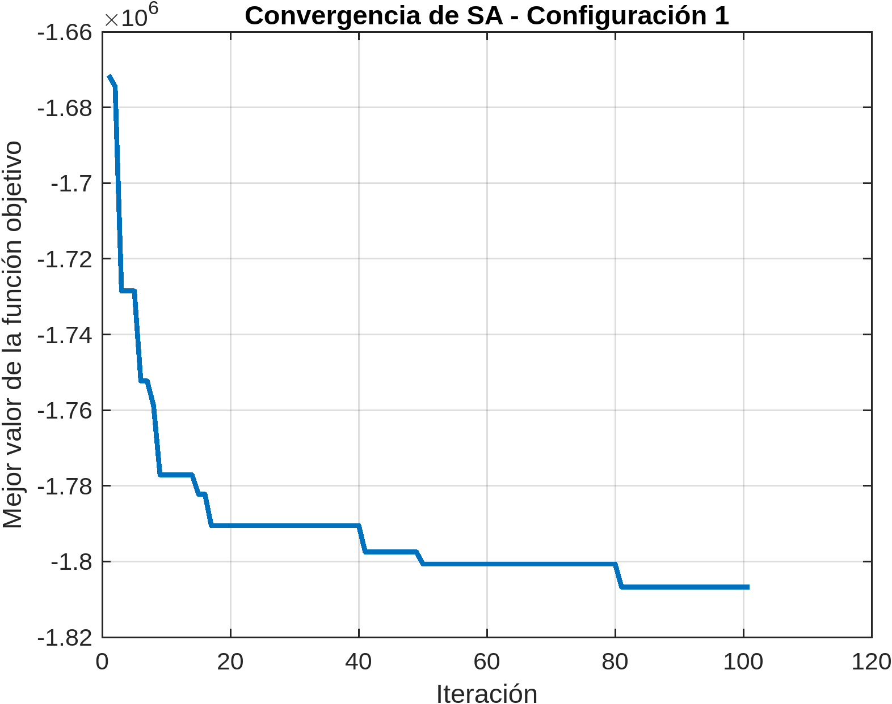

# Simulation example

## Design of Experiments

### Sampling the Design Space
To explore system behavior and establish a baseline for further analysis, a representative sampling of the design space was performed, defined as:  

- **Latitude** φ ∈ [-60°, 60°]  
- **Longitude** λ ∈ [0°, 360°]  

Because the simulation model is computationally expensive, an efficient, non-structured sampling method was chosen: **Latin Hypercube Sampling (LHS)**. This method ensures uniform coverage of the design space without requiring a large number of samples.  

A total of 40 points were generated across the full latitude-longitude domain. For each sampled point, the annual energy production of the solar panel was simulated, considering the Sun-Moon geometry, local temperature, and panel efficiency variation.

  
*Figure: Sampling, top view.*

  
*Figure: Sampling, 3D view.*

At first glance, energy production is higher at more extreme latitudes.

### Correlations
The relationship between input variables (latitude and longitude), other problem variables, and output (annual energy) was analyzed using **Pearson correlation coefficients**.

  
*Figure: Pearson correlation matrix.*

**Key observations:**

- **Energy:** The most influential factor is panel efficiency (0.97). Shadow hours significantly reduce energy production (-0.90), while sunlight hours (0.24) are less critical. Mean temperature has a moderate positive correlation (0.42), likely because regions with more sunlight are also warmer.  
- **Latitude & Longitude:** Both have low direct correlation with energy (-0.02 and -0.04), but longitude strongly negatively correlates with sunlight hours (-0.77), indicating topography effects. Latitude has low influence across variables, possibly due to the Moon’s low axial tilt.  
- **Extreme Latitude & Solar Altitude:** Absolute latitude is strongly negatively correlated with solar altitude (-0.99), confirming that near the poles the Sun stays near the horizon. Solar altitude also strongly affects temperature (0.75), which in turn influences energy (0.24 and -0.25 indirectly).  

**Implications for lunar solar panel optimization:**

- Minimize shadow hours rather than maximize sunlight hours.  
- Place panels in areas with high potential efficiency, possibly lower average temperatures.  
- Latitude and longitude influence energy indirectly through shadow, solar altitude, and temperature.  
- Prefer high and stable solar altitudes (e.g., crater peaks near lunar poles) for efficiency and constant solar availability.  

The initial simulation point is set at **(40°, 90°)**, with an objective function value of **-1787484.35 W**.

---

# Single-Objective Optimization with Gradient-Based Algorithms

## Gradient-Based Algorithms

### Algorithm Selection

The **MATLAB `fmincon`** algorithm was chosen, suitable for nonlinear optimization with constraints. Justifications:

* Continuous design space (latitude and longitude are real variables).
* Physical constraints (latitude [-60°, 60°], longitude [0°, 360°]).
* Objective function `simularEnergia` has no evident discontinuities, though flat zones or peaks may exist due to shadows.

### Single-Objective Optimization

The objective is the **total annual energy** of a fixed solar panel on the lunar surface:

```math
f(lat, lon) = -simularEnergia(lat, lon)
```

The negative is minimized because `fmincon` seeks minima.

Starting from **(40°, 90°)**, the algorithm converges quickly.

#### Iteration Results

| Iter | F-count | f(x)          | Feasibility | First-order Optimality | Step Norm |
| ---- | ------- | ------------- | ----------- | ---------------------- | --------- |
| 0    | 3       | -1.674446e+06 | 0.000e+00   | 4.870e+11              | -         |
| 1    | 7       | -1.726716e+06 | 0.000e+00   | 2.064e+09              | 0.7062    |
| ...  | ...     | ...           | ...         | ...                    | ...       |
| 28   | 195     | -1.834804e+06 | 0.000e+00   | 8.477e+09              | 6.334e-06 |

*Table: Iterations of `fmincon`.*

#### Optimization Results

* **Optimal Latitude:** 59.99°
* **Optimal Longitude:** 90.46°
* **Annual Optimized Energy:** -1,834,804.48 W
* **Initial Energy (40°, 90°):** -1,674,445.83 W
* **Relative Improvement:** 9.58%
* Converged in 29 steps with 198 function evaluations.
* The solution is feasible, though the gradient-based first-order optimality criterion is not fully satisfied, indicating a local minimum.

### Sensitivity Analysis

**Gradient at optimum:**

```math
∇F(x) = 10^9 × [-0.00000729, 8.4778187]
```

* Longitude has much higher influence than latitude, consistent with Pearson correlation analysis.

**Active Constraints (Lagrange Multipliers):**

```text
lambda.lower = [1.6666e-4, 1.0356e6]
lambda.upper = [7.29e3, 7.4202e-5]
```

* Latitude upper bound is active, limiting further increase.
* Longitude lower bound is active, constraining the solution.

Constraints are determined by the geographic data domain and cannot be freely modified.

### Global Optimum

`fmincon` is a **local gradient-based optimizer**, so global optimality is not guaranteed:

* Gradient at the optimum is not near zero.
* Only a single starting point was used.

To improve confidence in the global optimum:

* Run optimization from multiple starting points.
* Use a global optimization algorithm (e.g., PSO, GA, SA).

In summary, a **significant improvement over the initial point** was achieved, but the global optimum is not assured without further analysis.


# Heuristic Methods, Scaling

## Particle Swarm Optimization (PSO)

### PSO Configuration 1
- **Max Iterations:** 15

#### Optimization Results
- **Optimal Latitude:** 60.00º
- **Optimal Longitude:** 114.18º
- **Annual Optimized Energy:** -1,840,594.99 W
- **CPU Time:** 1038.80 s
- **Improvement over initial point (40,90):** 9.92%
- **Improvement over gradient-based optimum:** 0.32%

#### Iteration Table

| Iteration | f-count | Best f(x)   | Mean f(x)    | Stall Iterations |
|-----------|--------|-------------|--------------|----------------|
| 0         | 20     | -1.762e+06  | -1.587e+06   | 0              |
| 1         | 40     | -1.832e+06  | -1.661e+06   | 0              |
| 2         | 60     | -1.832e+06  | -1.681e+06   | 1              |
| 3         | 80     | -1.832e+06  | -1.7e+06     | 2              |
| 4         | 100    | -1.832e+06  | -1.7e+06     | 3              |
| 5         | 120    | -1.84e+06   | -1.698e+06   | 0              |
| 10        | 220    | -1.84e+06   | -1.652e+06   | 5              |
| 15        | 320    | -1.841e+06  | -1.653e+06   | 1              |

  
*Figure: Objective function value versus iteration.*

---

### PSO Configuration 2
- **Max Iterations:** 30

#### Optimization Results
- **Optimal Latitude:** 60.00º
- **Optimal Longitude:** 74.34º
- **Annual Optimized Energy:** -1,845,123.79 W
- **CPU Time:** 2045.27 s
- **Improvement over initial point (40,90):** 10.19%
- **Improvement over gradient-based optimum:** 0.56%

#### Iteration Table

| Iteration | f-count | Best f(x)   | Mean f(x)    | Stall Iterations |
|-----------|--------|-------------|--------------|----------------|
| 0         | 20     | -1.767e+06  | -1.585e+06   | 0              |
| 1         | 40     | -1.788e+06  | -1.639e+06   | 0              |
| 2         | 60     | -1.792e+06  | -1.676e+06   | 0              |
| 3         | 80     | -1.792e+06  | -1.698e+06   | 1              |
| 4         | 100    | -1.819e+06  | -1.73e+06    | 0              |
| 5         | 120    | -1.819e+06  | -1.674e+06   | 1              |
| 10        | 220    | -1.843e+06  | -1.622e+06   | 3              |
| 15        | 320    | -1.843e+06  | -1.679e+06   | 8              |
| 20        | 420    | -1.845e+06  | -1.704e+06   | 3              |
| 25        | 520    | -1.845e+06  | -1.736e+06   | 0              |
| 30        | 620    | -1.845e+06  | -1.702e+06   | 1              |

  
*Figure: Objective function value versus iteration.*

---

## Simulated Annealing (SA)

### SA Configuration 1
- **Max Iterations:** 100

#### Optimization Results
- **Optimal Latitude:** 57.89º
- **Optimal Longitude:** 43.71º
- **Annual Optimized Energy:** -1,806,782.74 W
- **CPU Time:** 359.55 s
- **Improvement over initial point (40,90):** 7.90%
- **Improvement over gradient-based optimum:** -1.53%

#### Iteration Table

| Iteration | f-count | Best f(x)   | Current f(x) | Mean Temperature |
|-----------|--------|-------------|--------------|-----------------|
| 0         | 1      | -1.59445e+06 | -1.59445e+06 | 100             |
| 10        | 11     | -1.7771e+06  | -1.7771e+06  | 56.88           |
| 20        | 21     | -1.7905e+06  | -1.7905e+06  | 34.0562         |
| 30        | 31     | -1.7905e+06  | -1.7905e+06  | 20.3907         |
| 40        | 41     | -1.7905e+06  | -1.7905e+06  | 12.2087         |
| 50        | 51     | -1.80067e+06 | -1.80067e+06 | 7.30977         |
| 100       | 101    | -1.80678e+06 | -1.80678e+06 | 0.56245         |

  
*Figure: Objective function value versus iteration.*

---

### SA Configuration 2
- **Max Iterations:** 200

#### Optimization Results
- **Optimal Latitude:** -59.99º
- **Optimal Longitude:** 126.79º
- **Annual Optimized Energy:** -1,843,001.87 W
- **CPU Time:** 727.00 s
- **Improvement over initial point (40,90):** 10.07%
- **Improvement over gradient-based optimum:** 8.02%

#### Iteration Table

| Iteration | f-count | Best f(x)   | Current f(x) | Mean Temperature |
|-----------|--------|-------------|--------------|-----------------|
| 0         | 1      | -1.66143e+06 | -1.66143e+06 | 100            |
| 10        | 11     | -1.7698e+06  | -1.7698e+06  | 56.88          |
| 20        | 21     | -1.7698e+06  | -1.7698e+06  | 34.0562        |
| 30        | 31     | -1.78156e+06 | -1.78156e+06 | 20.3907        |
| 40        | 41     | -1.78156e+06 | -1.78156e+06 | 12.2087        |
| 50        | 51     | -1.78156e+06 | -1.78156e+06 | 7.30977        |
| 100       | 101    | -1.83777e+06 | -1.83777e+06 | 0.56245        |
| 150       | 151    | -1.8427e+06  | -1.8427e+06  | 0.0432777      |
| 200       | 201    | -1.84298e+06 | -1.84298e+06 | 0.00333        |

  
*Figure: Objective function value versus iteration.*

---

## Summary Table of Algorithms

| Method          | Iter | Eval | CPU (s)  | f(x) (W)      | Lat (º) | Lon (º) | Improvement vs DoE | Improvement vs fmincon |
|-----------------|------|------|----------|---------------|---------|---------|------------------|-----------------------|
| DoE             | -    | -    | -        | -1,674,445.83 | 40.00   | 90.00   | -                | -                     |
| fmincon         | 29   | 198  | 804.86   | -1,834,804.48 | 59.99   | 90.48   | 9.58%            | -                     |
| fmincon (rescale)| 3   | 9    | 36.12    | -1,834,804.39 | 59.99   | 90.48   | 9.58%            | 0.00%                 |
| GA 1            | 15   | 226  | 802.48   | -1,750,676.63 | 57.28   | 336.23  | 4.55%            | -4.59%                |
| GA 2            | 30   | 872  | 3,269.64 | -1,770,957.79 | -49.89  | 142.05  | 5.76%            | -3.48%                |
| GA 3            | 50   | 2,403| 8,998.94 | -1,840,708.78 | 59.58   | 125.29  | 9.93%            | 0.32%                 |
| PSO 1           | 15   | 320  | 1,038.80 | -1,840,594.99 | 60.00   | 114.18  | 9.92%            | 0.32%                 |
| PSO 2           | 30   | 620  | 2,045.27 | -1,845,123.79 | 60.00   | 74.34   | 10.19%           | 0.56%                 |
| PSO 3           | 50   | 1,020| 3,545.16 | -1,844,561.90 | 60.00   | 74.28   | 10.16%           | 0.53%                 |
| SA 1            | 100  | 101  | 359.55   | -1,806,782.74 | 57.89   | 43.71   | 7.90%            | -1.53%                |
| SA 2            | 200  | 201  | 727.00   | -1,843,001.87 | -59.99  | 126.79  | 10.07%           | 0.45%                 |
| SA 3            | 300  | 301  | 1,094.21 | -1,808,725.19 | 59.99   | 25.05   | 8.02%            | -1.42%                |

*As observed, Particle Swarm Optimization achieves small improvements over fmincon, but the design variables are not near fmincon's optimum, indicating low confidence in a global optimum. Higher iterations or multiple starting points are recommended.*

---
Note: For the heuristic algorithms, the number of iterations was deliberately kept low to manage computation time and ensure outputs were available for the project. Although the improvements over the gradient-based results were limited, running these heuristics with more iterations would likely provide more reliable and potentially better optimization results.
