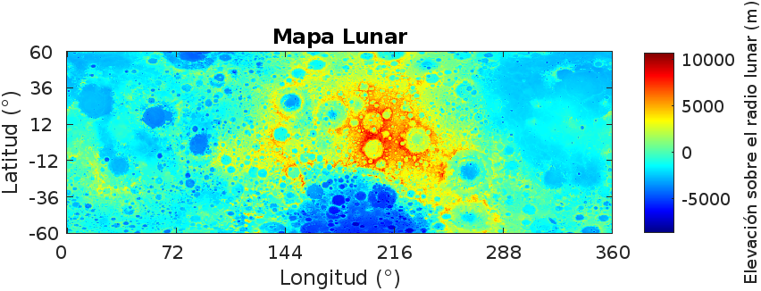

# Simulator Validation

### Data Interpretation

* Realistic elevation data was obtained from the **High-resolution Lunar Topography (SLDEM2015)** dataset.
* This global map covers latitudes between 60°S and 60°N.
* Due to the large file size, it was downsampled by keeping 1 out of every 10 points.
* The resulting map closely resembles the one from the **Lunar Orbital Data Explorer**.
  

---

### Shadow Simulator Validation

* The subsolar point calculation equations were validated against data from **JPL Planetary and Lunar Ephemerides**.
* The comparison shows a good fit between the model and observed data.

* To verify solar altitude and azimuth, the entire lunar surface was modeled as a perfect sphere.
* The resulting illumination map matches expectations for a celestial body with a 1.54° axial tilt.
  

* Critical height calculations were tested using a 2D synthetic terrain profile.
* Various solar altitudes were simulated, and the critical elevation between points A and B was plotted accordingly.

* A recognizable lunar region ("the Lunar X") was used to visually compare simulated shadows with real lunar photographs.
* The shadow map matches the real image with acceptable accuracy, confirming the shadow model’s reliability.
  

---

### Temperature Validation

* Surface temperatures were plotted for solar altitudes $\gamma$ ranging from -10° to 90°.
* Physical limits are confirmed:

  * Maximum temperature \~390 K at solar zenith (sun overhead)
  * Minimum temperature \~50 K when the sun is below horizon (night)
    

---

### Efficiency Validation

* Panel efficiency was plotted for temperatures between 50 K and 400 K.

* The model confirms:

  * Efficiency matches the reference value at nominal temperature (298.15 K)
  * Efficiency decreases linearly as temperature increases, as expected physically
  * No negative efficiency values appear within expected lunar temperature ranges

* Overall, the efficiency module behaves correctly across the expected operating range.
  

---
